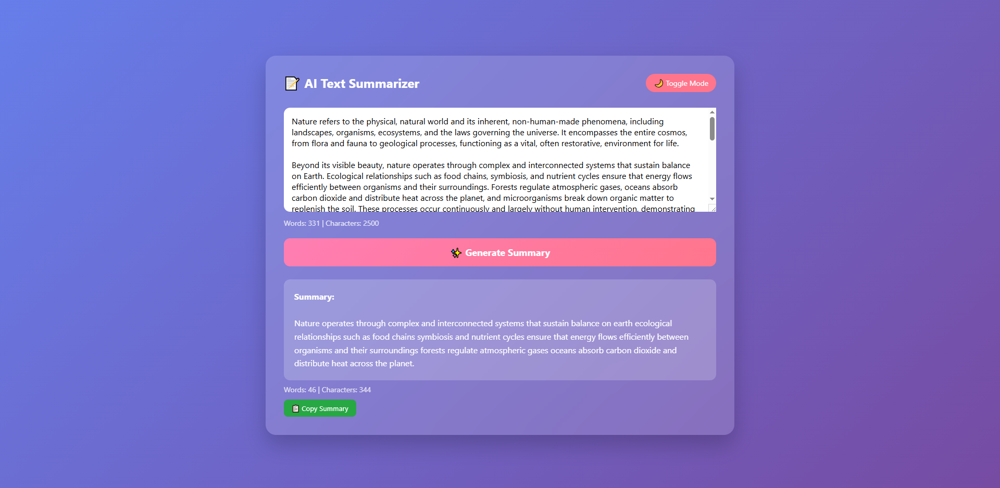
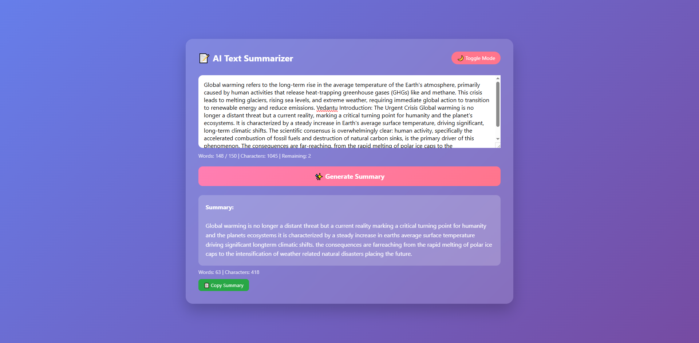

# AI Text Summarizer

A Transformer-based Text Summarization Web Application built using Flask and PyTorch.
The model is fine-tuned using the T5 Transformer architecture from the Hugging Face Transformers library and deployed with a simple and interactive web interface.

Users can input long text and generate a concise summary instantly.


# Features

✨ Transformer-based summarization

🧠 Fine-tuned T5 model

🌐 Flask web application

⚡ Fast inference using PyTorch

🎨 Clean and simple UI

☁️ Deployable on Render / Cloud platforms


# Project Structure

```
text-summarizer/
│
├── app.py                # Main Flask application
│
├── requirements.txt      # Python dependencies
│
├── models/               # Saved fine-tuned model
│
├── templates/            # HTML frontend files
│   └── index.html
│
├── ipynb/                # Jupyter notebooks for training
│   └── text_summarizer.ipynb
│
├── README.md             # Project documentation
│
└── images/               # Saved screenshots
```

# Requirements

The project uses the following Python libraries:

```
flask
gunicorn
torch
transformers
sentencepiece
```

### Install dependencies using:

```
pip install -r requirements.txt
```


# Model Details

The summarization model is based on the T5 (Text-to-Text Transfer Transformer) architecture.

The model was fine-tuned on a dataset where:

- Input: Long document/article

- Output: Short summary


# Application Workflow

```
User Input Text
      │
      ▼
Flask Web Server
      │
      ▼
Preprocessing
      │
      ▼
Transformer Model (T5)
      │
      ▼
Generated Summary
      │
      ▼
Displayed on Web UI
```

# Example Results






# Running the Application

Run the Flask app locally:

```
python app.py
```

Open in browser:

```
http://127.0.0.1:5000
```


# Training Notebook

The ipynb folder contains notebooks used for:

#### 1. Data preprocessing

#### 2. Tokenization

#### 3. Model training

#### 4. Model evaluation

#### 5. Saving the fine-tuned model


# Future Improvements

- Upload PDF / TXT files

- Multi-document summarization

- Better model fine-tuning 


# Thank you 